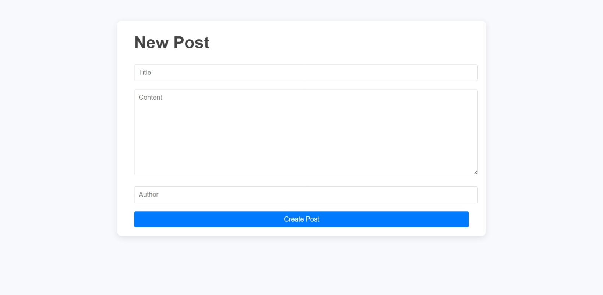
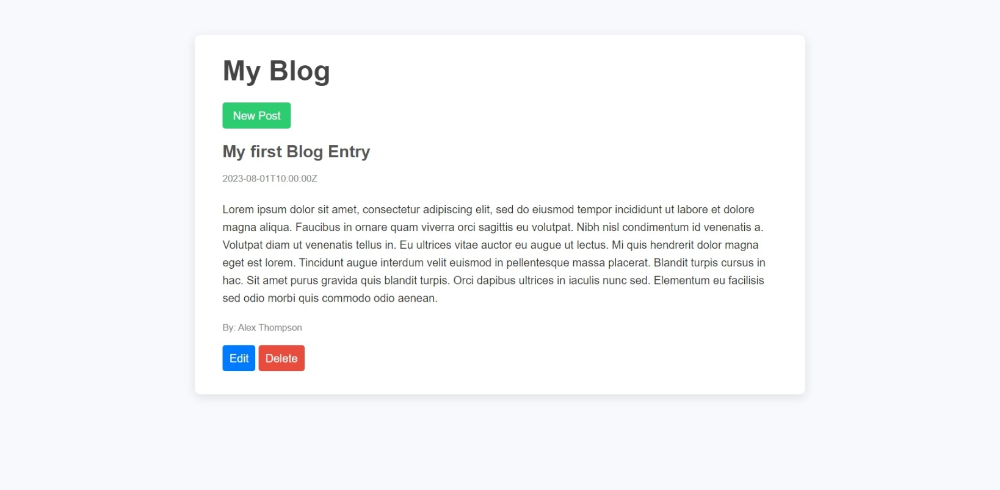

# Blog API Project

This is a simple blog project that I created during my time in the london app brewery's web development bootcamp. This project demonstrates my skills and understanding of back end development and RESTful APIs. 

## Table of contents

- [Overview](#overview)
  - [Screenshot](#screenshot)
- [My process](#my-process)
  - [Built with](#built-with)
  - [What I learned](#what-i-learned)
- [Setup](#running-the-blog-on-your-local-computer)
  - [Installing packages](#installing-packages)
  - [Running on command line](#running-on-command-line-bash)

## Overview

### Screenshot




THe blog API is capable of storing blog posts which can be edited or deleted. Since the server isn't connected to a database, the information stored in a session is only temporary, and would be deleted upon exiting or refreshing the page.

## My process

### Built with
- HTML
- CSS
- EJS
- Javascript
- NodeJS
- Axios

### What I learned

I was able to perform GET, POST, PATCH, and DELETE commands in a NodeJS server.

## Running the blog on your local computer

### Installing packages

Upon downloading/cloning the repository, execute the following commands in Bash or your Command line of choice to install the package dependencies.

```Bash
$ cd <repository filepath>
$ npm install
```

### Running on command line (Bash)

After which, open two instances of a terminal (which are have cd'd to the repository filepath), then run the following on each of them:

```Bash
$ node index.js
```

```Bash
$ node server.js
```

Both should return the following results:

```Bash
$ node index.js
API is running at http://localhost:4000
```
```Bash
$ node index.js
Backend server is running on http://localhost:3000
```

Open http://localhost:3000 on your browser, and you should see the blog site.
